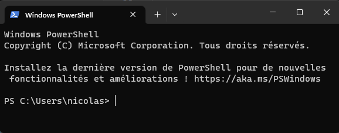

 
# PowerShell
  
                
                          
## Liste de commande utiles:
 - Get-Help : [**Get-Help**](#search--Get-Help) 
 - Get-Process : [**Get-Process**](#search--Get-Process) 
 - Get-Date : [**Get-Date**](#search--Get-Date)  
 - Get-Bar : [**Get-Bar**](#search--Get-Bar) 

<h3 id="search--Get-Help"></h3> 

## Get-Help
 <u>DESCRIPTION COURTE :</u>
Affiche l'aide sur les applets de commande et les concepts de Windows PowerShell.

* Pour obtenir de l'aide sur une applet de commande, tapez :
Get-Help <nom-applet_commande>  

* Pour obtenir de l'aide en ligne, tapez :
Get-Help <nom-applet_commande> -Online 

 Les titres des rubriques conceptuelles commencent par « About_ ».

*  Pour obtenir de l'aide sur un concept ou un élément de langage, tapez :
Get-Help About_ <nom-rubrique> 

* Pour rechercher un mot ou une expression dans l'ensemble des fichiers d'aide, tapez :
Get-Help <terme-recherché> 

* Pour plus d'informations sur l'applet de commande Get-Help, tapez :
Get-Help Get-Help -Online 

        Save-Help  : télécharge les fichiers d'aide à partir d'Internet et les enregistre sur un partage de fichiers.
        Update-Help  : télécharge et installe les fichiers d'aide à partir d'Internet ou d'un partage de fichiers.
        Get-Help Get-Process   : affiche l'aide relative à l'applet de commande Get-Process.
        Get-Help Get-Process -Online : ouvre l'aide en ligne relative à l'applet de commande Get-Process.
        Help Get-Process  : affiche l'aide relative à Get-Process page par page.
        Get-Process -?  : affiche l'aide relative à l'applet de commande Get-Process.
        Get-Help About_Modules : affiche l'aide relative aux modules Windows PowerShell.
        Get-Help remoting  : recherche le mot « remoting » dans les rubriques d'aide.

<h3 id="search--Get-Process"></h3>

## Get-Process
 <u>DESCRIPTION COURTE :</u>
lorem ipsum
<h3 id="search--ping">ping</h3>

 ### Quand on tape :  'copy /?'
cela donne toute les infos dont on a besoin.
## cela renvoi une commande type comme cela :
#### les choses obligatoire dans la commande est tout ce qui es sans [], le reste c'est des options. Possibilité de prendre une ou plusieurs options.Par contre on ne pourra pas cumulé [/A |/B] , car elle sont séparé par un pipeline, donc ce sera soit [/A] ou [/B]
#### le [+ ...] indique que nous pouvons ajouter plusieurs source.
`copy [/D] [/V] |[/N] [/Y | /Y] :Y: [/L] [/A | /B] source [/A | /B] |+ source [/A | /B] [+ ...] | [cible [/A |/B]]`

<h3 id="search--tracert">tracert</h3>

  Quand on tape :  'copy /?'
cela donne toute les infos dont on a besoin.
 cela renvoi une commande type comme cela :
 les choses obligatoire dans la commande est tout ce qui es sans [], le reste c'est des options. Possibilité de prendre une ou plusieurs options.Par contre on ne pourra pas cumulé [/A |/B] , car elle sont séparé par un pipeline, donc ce sera soit [/A] ou [/B]
 le [+ ...] indique que nous pouvons ajouter plusieurs source.
`copy [/D] [/V] |[/N] [/Y | /Y] :Y: [/L] [/A | /B] source [/A | /B] |+ source [/A | /B] [+ ...] | [cible [/A |/B]]`

<h3 id="search--Get-Bar"></h3>

## Get-Bar
 <u>DESCRIPTION COURTE :</u>
Lieux où l'ont ne boie pas que de l'eau :)

<h3 id="search--Get-Date"></h3>

## Get-Date
 <u>DESCRIPTION COURTE :</u>
Obtenir la date actuelle du système
