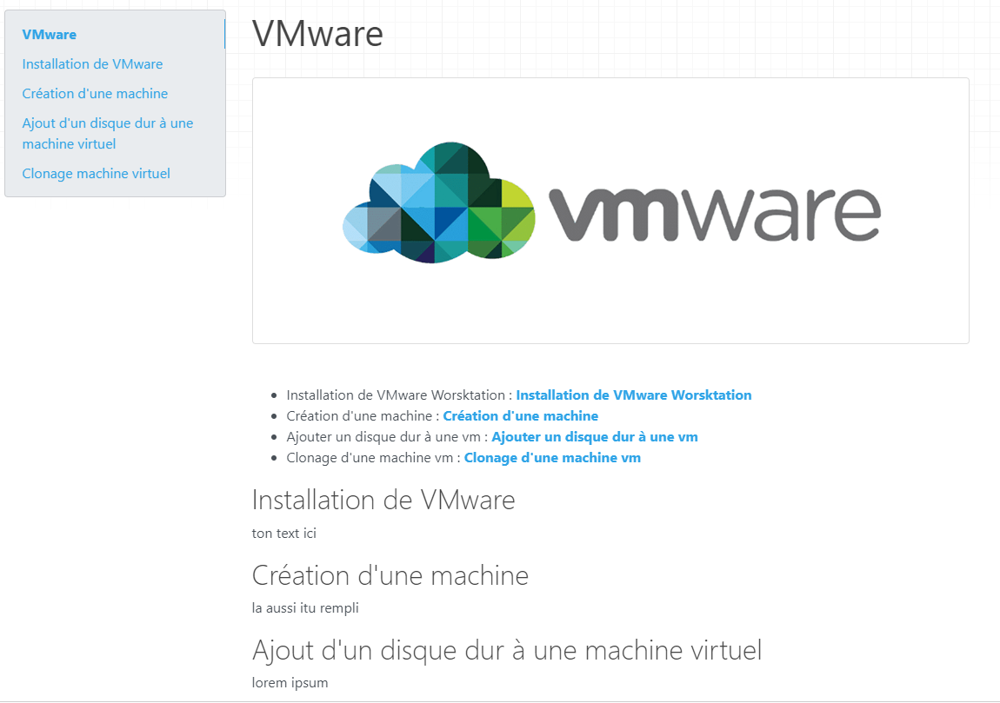

# VMware

<!--ici on affiche image -->
  
             
<!-- menu sous l'image pour utiliser le système d'ancre-->
 - Installation de VMware Worsktation : [**Installation de VMware Worsktation**](#search--Installation de VMware Worsktation) 
 - Création d'une machine : [**Création d'une machine**](#search--Création d'une machine) 
 - Ajouter un disque dur à une vm : [**Ajouter un disque dur à une vm**](#search--Ajouter un disque dur à une vm)  
 - Clonage d'une machine vm : [**Clonage d'une machine vm**](#search--Clonage d'une machine vm) 

<!-- Bloc Installation de VMware -->
<h3 id="search--Installation de VMware Worsktation"></h3>
<!--Ne rien mettre ici-->

## Installation de VMware 
ton text ici

<!-- Bloc Création'dune machine -->
<h3 id="search--Création d'une machine"></h3>
<!--Ne rien mettre ici-->

##  Création d'une machine
 la aussi itu rempli

<!-- Bloc  Ajouter un disque dur à une vm-->
<h3 id="search--Ajouter un disque dur à une vm"></h3>
<!--Ne rien mettre ici-->

##  Ajout d'un disque dur à une machine virtuel
lorem ipsum

<!-- Bloc Clonage d'une machine vm -->
<h3 id="search--Clonage d'une machine vm"></h3>
<!--Ne rien mettre ici-->

## Clonage machine virtuel
  etc  ....
