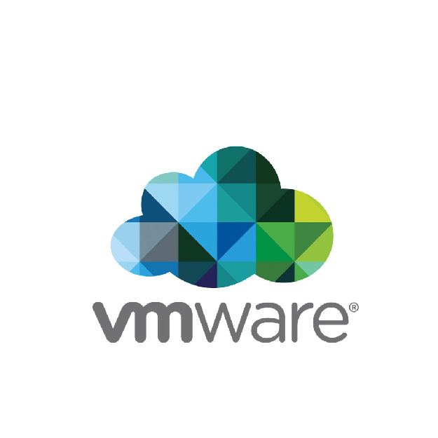

<!--ici on affiche image--> 
  
   

# Procédure de création pour une machine virtuel (aussi appelé vm)

##	On va commencer par lancer l’application :
	Double clique sur l’icone
 
## Ensuite nous sélectionnons ce que nous voulons faire 
	Création d’une nouvelle machine virtuel
	Ouvrir une machine virtuel
	Connection à un serveur distant
Simple clique sur l’icône Open a Virtual Machine
 
## Ont choisi ce que l’on souhaite faire ? 
	Création d’une machine virtuel classique
	Création d’un machine personnalisé)
Sélectionner Typical, cliquer sur Next

 
## Ont choisi ce que l’on souhaite faire ? 
	Install from :  Aucun lecteur installé
	Installer disk image (iso ) : renseigner le chemin vers l’iso (de l’ Os à installer
	I will install … : la machine virtuel sera crée avec un disque dur vierge, mais pas d’Os d’installé.
Sélectionner Typical, cliquer sur Next
 
## Ont renseigne quel système d’exploitation cette machine virtuel va hébergée 
-	Guest Opération system : 
	Microsoft Windows
	Linux
	VMware ESX
	Autre 
Sélectionner Microsoft Windows, maintenant nous devons fournir le model et la version du système d’exploitation version Windows 10 x64 , puis faire NEXT

 
On renseigne les informations, nom et emplacement de la machine virtuel
On rentre le Virtual machine name Win10-NL
On clique sur Browse … pour aller choisir le chemin du dossier de stockage

 

On sélectionne le chemin vers le répertoire de stockage pour la machine virtuel, et on valide avec un clique sur OK
 
On vérifie que les informations sont correct, et si tout est ok , alors on peut clique sur Next
 
Ont choisi ce que l’on souhaite pour la capacité de stockage ? 
   Maximum disk size : renseigner la taille du disque dur.  ( 32.0 )
	Store virtual disk as a single file. (Le disque dur est sur un seul fichier)
	Store virtual disk multiplle files (le disque dur est sur plusieurs fichiers)
On sélectionne Store virtual disk as a single
Cliquer sur Next
 
Un récapitulatif des informations sont affichées avant d’aller plus loin.
Si besoin de modifier : cliquer sur Customize Hardware …  (Pour ouvrir le popup de paramétrage de la machine)
Sinon on Cliquer sur Finish* (*Dans notre cas nous allons cliquer sur Customize Hardware ...)
 
Nous avons un aperçu du paramétrage de la machine virtuel. (la fenêtre est divisé en deux parties , la gauche pour le device , la partie de droite pour modifier le (s) paramétrage(s).
 
Ont choisi ce que l’on souhaite pour la Mémoire (RAM) ? 
	Soit on renseigne la taille de la mémoire que l’on souhaite allouée à la machine virtuel.
	Soit on déplace le curseur vertical, jusqu’à la valeur souhaité.
 
Ont choisi ce que l’on souhaite pour le processeur (CPU) ? 
	Nombre de processeurs
	Nombre de cœurs par processeur

Ont choisi ce que l’on souhaite le moteur de virtualisation ? 
	Virtualize Intel VT-x/EPT ou AMD-V/RVI
	Virtualize CPU performance counters
	Virtualize IOMMU (IO memory y management unit)
 
Charger un system d’exploitation :
Device status 
	Connected
	Connect at power on
Connection
	Utiliser le lecteur physique
	Utiliser une image disque d’un Os
 
Sélection de l’Os à installer pour la machine virtuel
	On sélectionne un Os au format .iso
cliquer sur Ouvrir
 
On finalise la création de la machine virtuel ? 
	Close (confirme la création )
	Help (ouvre la page d’aide de Workstation )
Pour finir cliquer sur Close

 
Maintenant nous pouvons voir (dans la Librairie) que notre machine à bien été créer sous le nom : WIN10-NL 
Pour démarrer la machine virtuel, il suffit juste de cliquer sur la flèche verte Power on this virtual machine
